# CRUD Reserva de hoteles
Trabajo compartido entre las asignaturas de programación y base de datos donde se realizará un CRUD (create, read, update and delete) en JSP y MySql
## Descripción

Temática CRUD: reservas de hoteles.

Lo primero que tiene que hacer el administrador para que la aplicación funcione es añadir un cliente, si no hay clientes no se pueden hacer reservas, una vez añadido el cliente se podrá hacer la reserva de cualquier hotel.
Los clientes se pueden añadir, modificar y dar de baja.
Las reservas solo se pueden añadir y cancelar, no se pueden modificar.

## Explicación de la APP con capturas de pantalla

### [index.jsp](https://github.com/luciaflores25/CRUD_JSP/blob/master/ReservaHoteles/index.jsp)
El index es la página principal, donde se puede elegir entre:
	* Añadir un cliente
	* Ver un listado de clientes
	* Añadir una reserva
	* Ver un listado de reservas
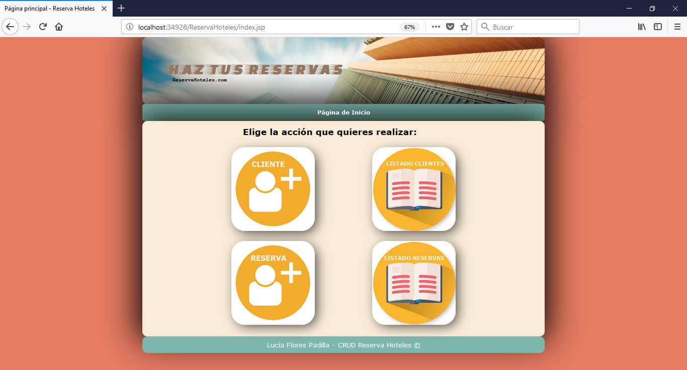

### [nuevoCliente.jsp](https://github.com/luciaflores25/CRUD_JSP/blob/master/ReservaHoteles/nuevoCliente.jsp) 
Al pulsar en el icono de añadir un cliente aparece el siguiente formulario donde hay que escribir los siguientes campos (El código de cada cliente se va auto incrementando, por lo que no hay que ponerlo):
	* Nombre del cliente
	* Apellidos
	* DNI
	* Email
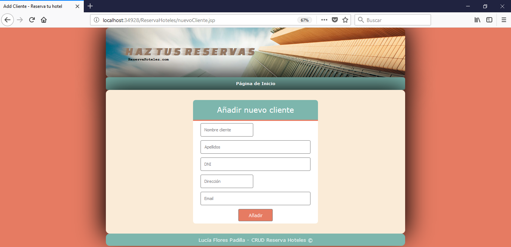

### [grabaCliente.jsp](https://github.com/luciaflores25/CRUD_JSP/blob/master/ReservaHoteles/grabaCliente.jsp) 
Esta página aparece cuando se pulsa el botón añadir y el cliente se ha añadido correctamente sin ningún fallo. Al pulsar el botón "Dar de alta otro cliente" te llevará de nuevo al formulario de nuevoCliente.jsp En el caso de pulsar aceptar te llevará al listado de todos los clientes.
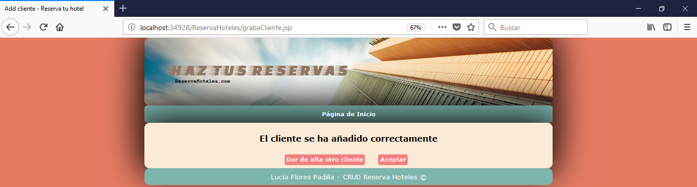

### [listadoCliente.jsp](https://github.com/luciaflores25/CRUD_JSP/blob/master/ReservaHoteles/listadoCliente.jsp) 
Desde esta página se puede ver el listado de los clientes y el código del cliente, que hará falta posteriormente para hacer una reserva.
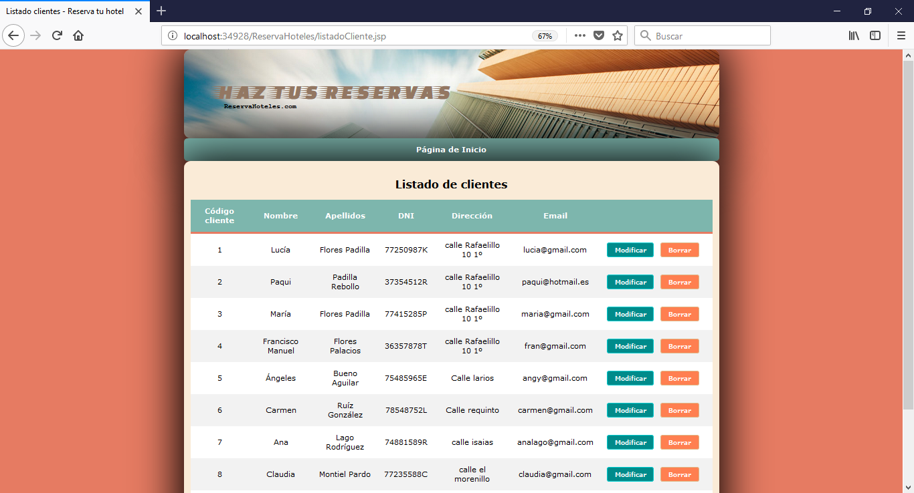

### [modificaCliente.jsp](https://github.com/luciaflores25/CRUD_JSP/blob/master/ReservaHoteles/modificaCliente.jsp) 
Desde la página del listado aparece el botón modificar que si se pulsa aparece el mismo formulario de nuevoCliente, pero relleno con los datos del cliente que hayamos seleccionado, en la siguiente imagen se muestra un ejemplo:
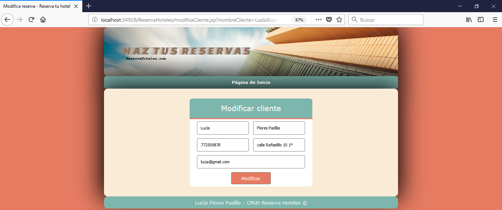

### [errorDNI.jsp](https://github.com/luciaflores25/CRUD_JSP/blob/master/ReservaHoteles/errorDNI.jsp) 
En el caso de que se pulse el botón añadir (formulario de nuevoCliente) o modificar (formulario modificaCliente) y haya registrado un cliente con el mismo DNI que se ha introducido, aparecerá la siguiente página de error, con el botón de intentar de nuevo que te vuelve a redireccionar a la pag de nuevoCliente.jsp
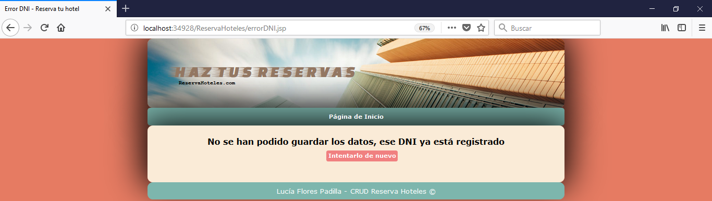

### [grabaClienteModificado.jsp](https://github.com/luciaflores25/CRUD_JSP/blob/master/ReservaHoteles/grabaClienteModificado.jsp) 
Esta página aparece cuando se pulsa el botón modificar y el cliente se ha modificado correctamente sin ningún fallo. Al pulsar aceptar te llevará al listado de todos los clientes para visualizar que se ha añadido correctamente, y al pulsar hacer otra modificación te llevará también al listado por si se desea hacer otra modificación.
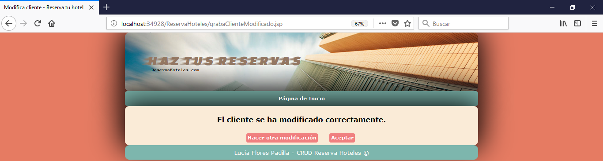

### [confirmacionBorradoCliente.jsp](https://github.com/luciaflores25/CRUD_JSP/blob/master/ReservaHoteles/confirmacionBorradoCliente.jsp) 
Desde la página del listado de todos los clientes también se pueden dar de baja pulsando en "Borrar", donde aparecerá la siguiente confirmación
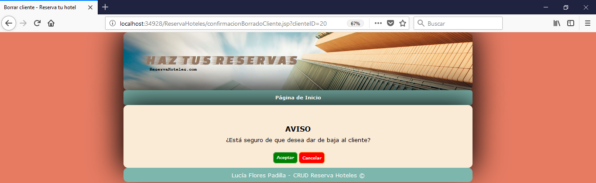

Para hacer una reserva volvemos al index.jsp

### [nuevaReserva.jsp](https://github.com/luciaflores25/CRUD_JSP/blob/master/ReservaHoteles/nuevaReserva.jsp) 
Desde el index al pulsar en el icono de añadir una reserva aparece el siguiente formulario donde hay que escribir los siguientes campos (El código de cada reserva se va auto incrementando, por lo que no hay que ponerlo):   Para este formulario hay que recordar el código del cliente, de donde se extraen los datos del cliente al que corresponde el código introducido para mostrarlo en el listado de las reservas.
	* País Hotel
	* Nombre Hotel
	* Código cliente
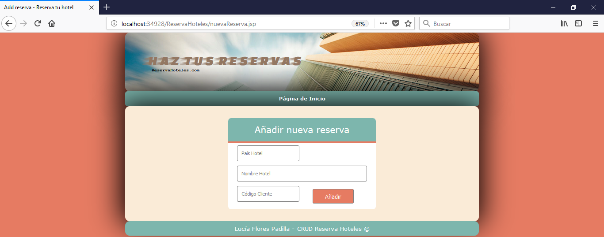

### [listadoReservas.jsp](https://github.com/luciaflores25/CRUD_JSP/blob/master/ReservaHoteles/listadoReservas.jsp) 
Si la reserva se añade correctamente aparecerá lo que se ve en la siguiente captura, un listado de todas las reservas con su correspondiente botón de cancelar.
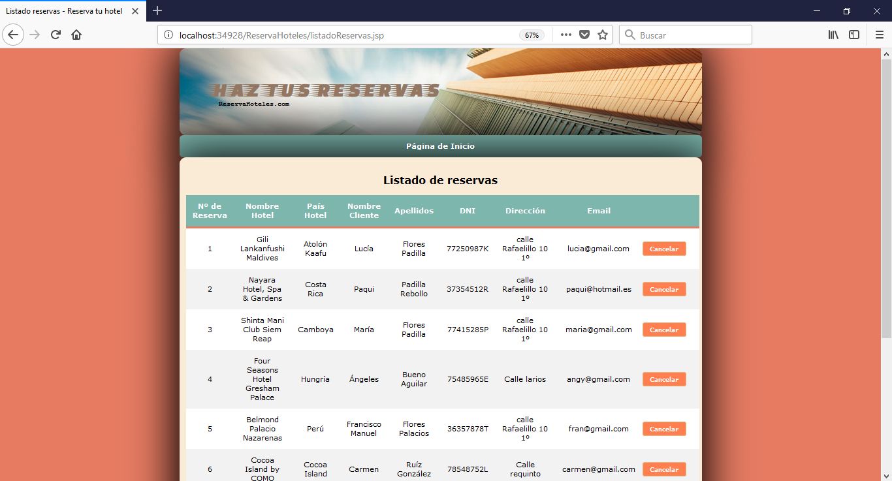

### [errorCliente.jsp](https://github.com/luciaflores25/CRUD_JSP/blob/master/ReservaHoteles/errorCliente.jsp) 
Si al añadir una nueva reserva, introducimos el código de un cliente que no está dado de alta, aparecerá un error como en el de la siguiente captura.

### [grabaReserva.jsp](https://github.com/luciaflores25/CRUD_JSP/blob/master/ReservaHoteles/grabaReserva.jsp) 
Esta página aparece cuando se pulsa el botón añadir y la reserva se ha añadido correctamente sin ningún fallo. Al pulsar el botón "Hacer otra reserva" te llevará de nuevo al formulario de nuevaReserva.jsp En el caso de pulsar aceptar te llevará al listado de todas las reservas.
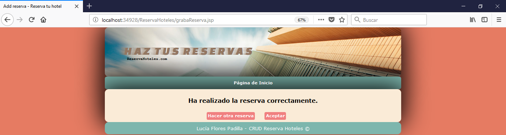

### [confirmacionBorrado.jsp](https://github.com/luciaflores25/CRUD_JSP/blob/master/ReservaHoteles/confirmacionBorrado.jsp) 
Al pulsar en el botón cancelar que aparece en el listado de las reservas, aparecerá una página de confirmación como se ve en la captura.

