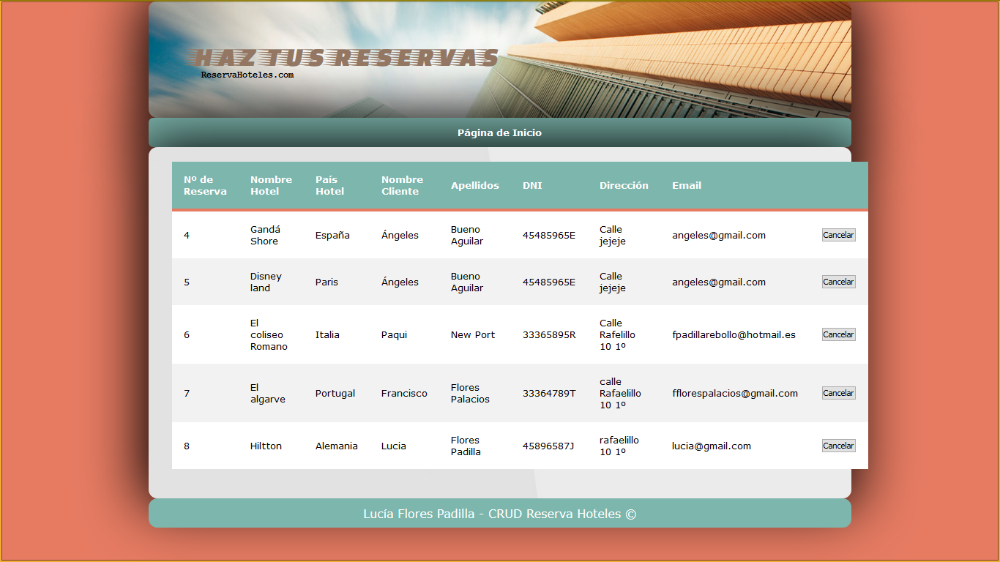
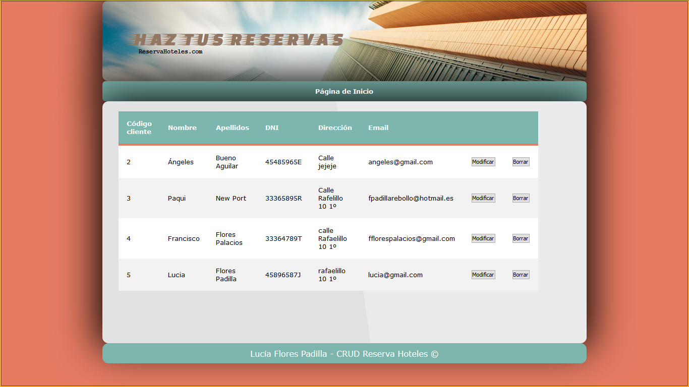
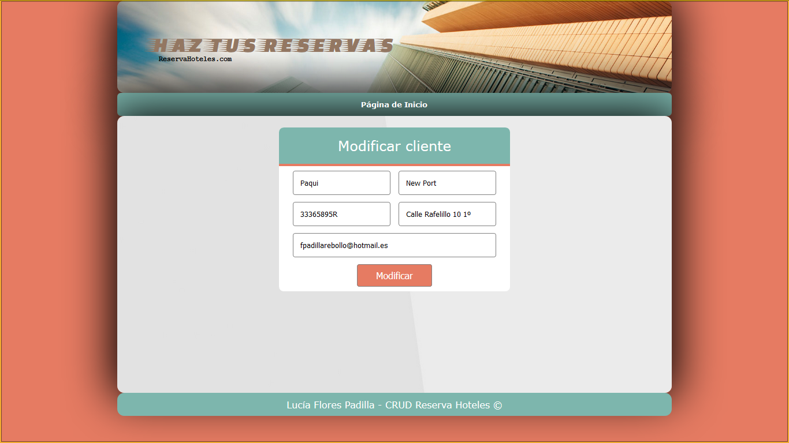
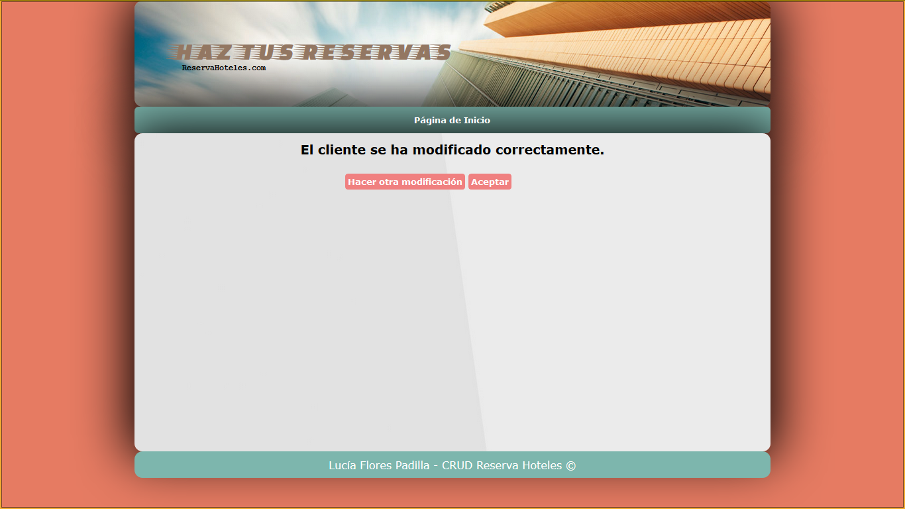
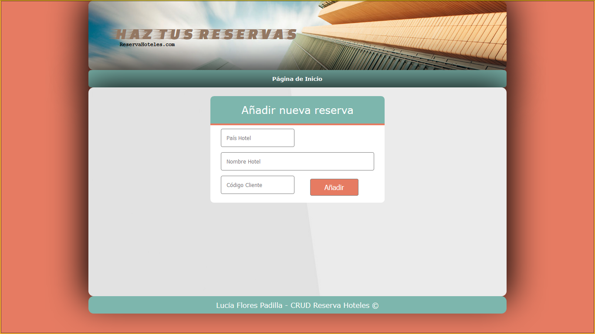

# CRUD Reserva de hoteles
Trabajo compartido entre las asignaturas de programación y base de datos donde se realizará un CRUD (create, read, update and delete) en JSP y MySql
## Descripción
Temática CRUD: reservas de hoteles, el administrador de las reservas desde la web podra añadir una reserva de un hotel o borrarla

El administrador también podrá añadir clientes que se podrán modificar y dar de baja

## Capturas

### index.html --> Aquí se muestra el index donde se puede elegir entre ver el listado de las reservas o de los clientes, o añadir un nuevo cliente o reserva

### listadoReservas.jsp --> Aquí se muestra el listado de las reservas

### confirmacionBorrado.jsp --> Aquí se muestra la confirmación de cancelar una reserva

### listadoCliente --> Aquí se muestra el listado de los clientes

### modificaCliente --> Al pinchar en modificar dentro de la pag listadoCliente.jsp se muestra un formulario con los datos de ese cliente

### grabaClienteModificado.jsp --> Aquí se muestra que el cliente se ha modificado correctamente sin errores

### confirmacionBorradoCliente.jsp --> Aquí se muestra la confirmación de dar de baja a un cliente

### nuevoCliente.jsp --> Aquí se muestra el formulario para añadir un nuevo cliente

### nuevaReserva.jsp --> Aquí se muestra el formulario para añadir una nueva reserva, el cliente se selecciona con su código

### errorCliente.jsp --> Error al intentar hacer una reserva con un clienteID que no está dado de alta

### errorDNI.jsp --> Error para que no se pueda repetir el DNI de los clientes

### grabaCliente.jsp --> Aquí se muestra que el cliente se ha añadido correctamente

### grabaReserva.jsp --> Aqui se muestra que el socio se ha dado de alta correctamente

